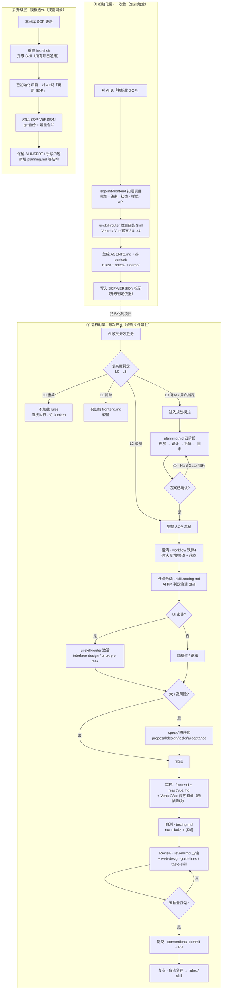
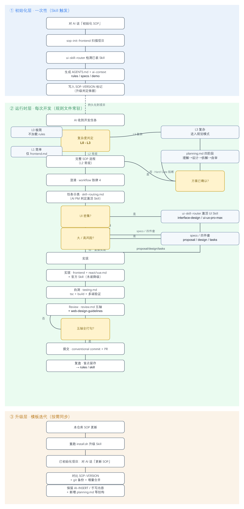

<!-- SOP-VERSION: 3.5 -->

# sop-frontend-kit — 前端项目 AI 协作脚手架（可插拔）

> **SOP 版本：v3.5**

一套**可复用的前端 AI 协作规范模板包**。放到任意前端项目中调用一次，AI 自动扫描项目结构并生成 `AGENTS.md` + `ai-context/` + `rules/` + `specs/` + `demo/`。支持 CodeBuddy / WorkBuddy 双工具。

---

## 安装（一键）

在仓库根目录执行：

```bash
bash scripts/install.sh          # Git Bash / Terminal
# Windows 也可直接运行（自动调用 Git Bash）：
scripts\install.bat
```

脚本会以**互动模式**运行，依次询问你：

1. **安装到哪个 AI 工具？** — WorkBuddy / CodeBuddy / 两者都装
2. **需要哪些框架 Skill？** — React 为主 / Vue 为主 / 两者都装 / 跳过

自有 Skill（始终安装）：

- `sop-init-frontend` — 提供「初始化 SOP」触发词
- `ui-skill-router` — UI / React / Vue Skill 调度器（AI PM）

推荐外部 Skill（按你的选择给出安装指令，**不自动执行**）：

| 你的选择 | 给出的指令 |
|---------|-----------|
| React 为主 | `npx skills add vercel-labs/agent-skills` |
| Vue 为主 | `npx skills add vuejs-ai/skills` |
| 两者都装 | 两条指令都给出 |
| 跳过 | 提示需要时再执行 |

> 非互动模式（CI）：`bash scripts/install.sh --all-react` / `--all-vue` / `--all`。
>
> Windows：cmd/PowerShell 直接 `scripts\install.bat`（自动调用 Git Bash）；或 Git Bash 中 `bash scripts/install.sh`。

<details>
<summary>手动安装 / 手动用模板（脚本不可用时的兜底）</summary>

**手动安装 Skill：**

```bash
# WorkBuddy — 仅自有 Skill
cp -r skills/sop-init-frontend ~/.workbuddy/skills/
cp -r skills/ui-skill-router ~/.workbuddy/skills/

# React 项目还需安装 Vercel 官方 Skill：
# npx skills add vercel-labs/agent-skills

# CodeBuddy（把 ~/.workbuddy 换成 ~/.codebuddy）
```

**完全不装 Skill、只用模板：** 复制 `skills/sop-init-frontend/templates/` 下模板，按 `{{占位符}}` 与 `<!-- AI-INSERT: xxx -->` 标记自行填充。

</details>

---

## 怎么用

1. 打开你的前端项目（React / Vue / Taro / Next.js … 均可）
2. 对 AI 说：**「初始化 SOP」** 或 **「建立 AI 协作规范」**
3. AI 先扫描项目结构（框架、路由、状态管理、样式、API 层等），出示结果让你确认
4. 确认后自动生成全套文件到项目内
5. 此后每次开发任务，AI 会自动判定复杂度（L0-L3），简单任务轻装上阵，复杂任务深度规划

---

## 升级已初始化的项目

本仓库 SOP 模板改动后，已初始化的项目需同步，**分两步**：

**第一步：升级 Skill（所有项目通用）** —— 重跑安装脚本，所有项目立即用上最新 Skill 版本：

```bash
./scripts/install.sh        # 或 all
```

**第二步：同步项目内的 rules（按需）** —— 在**已初始化的项目**里对 AI 说 **「更新 SOP」** 或 **「同步最新规范」**，AI 会：

1. 读取项目 `AGENTS.md` 顶部的 `SOP-VERSION` 标记，对比本仓库版本
2. **增量合并**——保留你已填充的内容（AI-INSERT 区域、已知陷阱、手写章节），只新增/更新模板结构变化
3. 新增旧版本没有的文件（如 v3.2→v3.3 新增的 `planning.md`）
4. 更新 `AGENTS.md` 的版本标记与导航
5. 输出变更报告，并在合并前对 `ai-context/` 做一次 git 备份

> 不会直接覆盖项目内容。遇到无法安全合并的冲突会停下来询问你如何处理。

每个生成的项目 `AGENTS.md` 顶部都有 `<!-- SOP-VERSION: x.y -->`，这是「更新 SOP」判断是否需要升级的依据。

---

## SOP 健康检查 / CI 硬门禁 ★

初始化后的项目自带 `scripts/sop-check.mjs`（零依赖 Node 脚本），把软纪律变成可执行、CI 可阻断的硬约束（移植自 harness-engineering「验证优于说教」）：

```bash
node scripts/sop-check.mjs            # 检查（WARN 不阻断）
node scripts/sop-check.mjs --strict   # CI 用：警告也计为失败
node scripts/sop-check.mjs --json     # 机器可读输出
```

| 级别 | 检查项 |
|------|--------|
| **FAIL** | AGENTS.md / SOP-VERSION 标记缺失、必要 rules 缺失、仍有未填占位符 `{{...}}` |
| **WARN** | 版本漂移、TODO/TBD/待定残留、rules 文件 > 400 行、跨文件重复段落、frontend.md 缺 NFR 节 |

接入 CI（示例）：

```yaml
# .github/workflows/sop-check.yml
- run: node scripts/sop-check.mjs --strict
```

> kit 仓库自身也有自检：`node scripts/kit-self-check.mjs`（校验版本一致 / 模板齐全 / 占位符命名 / 废弃 skill 无残留），供 kit 维护者用。

---

## 生成的文件一览

```
<你的项目>/
├── AGENTS.md                          # 统一入口（CodeBuddy + WorkBuddy）+ SOP 版本标记
├── ai-context/
│   ├── project-map.md                 # 目录地图 + 项目特有机制
│   ├── prd.md                         # 产品定位 + 模块清单
│   ├── design.md                      # 架构设计 + 特有机制详解
│   └── rules/
│       ├── frontend.md                # 代码风格（必读）+ 非功能需求(NFR)节 ★
│       ├── react.md                   # React 项目宪法 ★（第 0 节：代码风格；后续：Hooks/ErrorBoundary/Suspense 等）
│       ├── vue.md                     # Vue 专属约束 ★（仅 Vue 项目）
│       ├── platform.md                # 多端/多环境矩阵
│       ├── workflow.md                # 开发流程纪律 + 任务分类 + 任务闭环
│       ├── planning.md                # 复杂任务规划模式 ★（L3 四阶段：理解→设计→拆解→自审）
│       ├── testing.md                 # 验证基线 + TDD 工作流
│       ├── review.md                  # 五轴 Review 清单 + 可执行检查 ★
│       └── skill-routing.md           # Skill 调度规则（AI PM）★
├── specs/
│   ├── README.md                      # spec 归档说明 + 大/高风险触发判据
│   └── TEMPLATE.md                    # 大需求四件套模板（含交付审计）
├── demo/
│   └── README.md                      # 好实践示例（参考，不入库构建）
└── scripts/
    └── sop-check.mjs                  # SOP 健康检查 / CI 硬门禁 ★
```

> `react.md` / `vue.md` 根据扫描到的框架**二选一**生成；`specs/`、`demo/` 默认生成空壳 + 说明，随项目发展填充。

---

## 功能流程图谱

本套 SOP 分三层协作：**初始化层**（一次性生成规则文件）、**运行时层**（每次开发自动生效）、**升级层**（模板迭代按需同步）。运行时入口先做复杂度判定（L0-L3），简单任务轻装、复杂任务深度规划。



> 静态图片版（便于在不支持 Mermaid 渲染的预览中查看）：
>
> 
>
> *矢量源文件：[assets/functional-flow.svg](assets/functional-flow.svg)*

---

## 特色机制

- **硬门禁脚本（验证优于说教）** ★：`scripts/sop-check.mjs` 把"AGENTS.md 存在 / 占位符已填 / 版本一致"等软纪律变成 CI 可阻断的硬约束；`--strict` 模式警告也计失败。移植自 harness-engineering。
- **熵检测（entropy GC 窄版本）** ★：sop-check 自动检测 rules 超长（>400 行）、跨文件重复段落、TODO/TBD 残留，防止 AI 生成的规则随时间臃肿。移植自 harness-engineering 的 entropy garbage collection。
- **非功能需求（NFR）承载** ★：`frontend.md` 新增「非功能需求」节——性能预算 / 安全基线 / 可访问性 / 浏览器兼容 / 国际化，作为可恢复、可校验的项目级约束。移植自 harness-engineering。
- **累积一致性** ★：复盘时踩过的坑不只写散文，而是沉淀为 `review.md` 可勾选检查项或 `sop-check` 检测规则，让一次踩坑变成后续所有任务的自动约束。移植自 harness-engineering。
- **复杂度分级（L0-L3）** ★：每次任务自动判定复杂度——L0 极简直接执行（0 token 规则开销）、L1 简单仅加载前端风格、L2 常规走完整 SOP、L3 复杂进入深度规划模式。简单任务不为不需要的约束买单。
- **复杂任务规划模式** ★：L3 任务触发四阶段规划（理解需求 → 方案设计 → 任务拆解 → 自审），方案确认前**不写任何代码**。融合 ECC `planner.md` 的结构化方案 + Superpowers 的苏格拉底式提问 + bite-sized 任务粒度（2-5 分钟/task）。
- **全生命周期闭环**：复杂度预检 → 澄清 → 任务分类 + Skill 调度 → **规划（L3）** → UI 设计 → spec → 实现 → 自测 → Review → 提交 → 复盘，十一个阶段。
- **TDD 引导** ★：L3 复杂任务强烈建议采用 RED-GREEN-REFACTOR 循环；Bug 修复建议先写复现测试。灵感来自 Superpowers `test-driven-development`。
- **验证前置** ★：禁止未验证就声称完成——必须实际跑过类型检查 + 构建 + 多端验证后才算完成。灵感来自 Superpowers `verification-before-completion`。
- **Spec 自审清单** ★：spec 写好后的 Placeholder 扫描 / 一致性检查 / 范围检查 / 歧义检查，防止 TBD/TODO 污染。灵感来自 Superpowers `writing-plans`。
- **Hard Gate 机制** ★：L3 任务方案确认前禁止写实现代码；Review 五轴全部打勾才能提交。灵感来自 Superpowers 的 HARD GATE 设计。
- **代码风格就地扫描** ★：`react.md`/`vue.md`/`framework-generic.md`/`frontend.md` 在初始化时从项目真实代码中采样 5-10 个文件，提取声明方式、导出模式、类型标注偏好等，**以项目实际写法为准**。样本不足时主动询问用户保留已有风格还是采用官方推荐。
- **用户口述约束注入** ★：初始化或更新 SOP 时主动询问「你是否有额外的代码约束想加入？」，用户口述后 AI 识别并写入对应规则文件（React → `react.md` 0.6 节、Vue → `vue.md` 0.6 节、通用 → `frontend.md`），无需用户手动改配置文件。
- **AI PM 决策层**：内置 `skill-routing.md`，根据任务特征信号自动判定激活哪个 Skill（Vercel 官方 Skill / UI Skill / 框架 Skill），未安装自动降级。
- **框架专属约束**：React 搭配 Vercel 官方 `react-best-practices`（40+ 性能规则）+ `composition-patterns`（组件设计）；Vue 搭配 Vue 官方 `vuejs-ai/skills`（8 个专用 Skill，覆盖最佳实践/路由/Pinia/Composables/测试/调试）；**其他前端框架（Svelte/Angular/Solid/Vanilla）与后端语言（Python/Go/Java/Rust/...）走 `framework-generic.md` 通用兜底**（第 0 节代码风格扫描 + 该栈官方最佳实践）。官方 Skill 未安装时自动降级，不阻塞开发。
- **Skill 调度器**：`ui-skill-router` 协调 15+ 个外部 Skill（Vercel 官方 3 个 + Vue 官方 8 个 + 用户级 UI 4 个）按生命周期接力，未安装时自动降级，不阻塞开发。
- **五轴 Review**：正确性 / 可读性 / 架构 / 安全 / 性能 + 前端专项 + UI 审美/系统化审计（Vercel web-design-guidelines 100+ 规则）。
- **盲点留存**：遇到非显而易见的坑，AI 主动问你是否记成项目规则或 Skill，避免下次再犯（支持写入框架专属陷阱节）。
- **平台自适应**：支持手写路由 / File-based Router / 编译期插件注入等不同路由模式。
- **双工具兼容**：生成的 `AGENTS.md` 与 `ai-context/` 同时被 CodeBuddy 和 WorkBuddy 读取，规则一致。
- **框架层可插拔兜底** ★：不再只认 React/Vue。检测到 Svelte/Angular/Solid/Vanilla 等**其他前端框架**，或 Python/Go/Java/Rust 等**后端语言**时，自动生成 `rules/framework-generic.md`（第 0 节代码风格扫描 + 通用工程纪律 + 该栈官方最佳实践）。React/Vue 仍走深度专用模板；其余一切走通用兜底，项目约定始终优先。

---

## 其他框架 / 非前端项目怎么办？

本 kit 命名带 "fe"（frontend），但**框架层从 v3.5 起可插拔**——它不会再因为"不是 React/Vue"就退化成只有通用规则。初始化时按以下分类决定生成什么：

| 项目类型 | 检测信号 | 生成的框架级 rules | 说明 |
|---------|---------|------------------|------|
| **React**（含 Next.js / Taro-React / Remix） | `package.json` 含 `react` | `react.md` + `frontend.md` | 深度专用模板 + Vercel 官方 Skill |
| **Vue**（含 Nuxt / Taro-Vue） | `package.json` 含 `vue` | `vue.md` + `frontend.md` | 深度专用模板 + Vue 官方 8 Skill |
| **其他前端框架** | 含 `svelte` / `angular` / `solid` / 纯 `vite`+`vanilla` | `framework-generic.md` + `frontend.md` | 通用兜底，第 2 节填入该框架官方最佳实践 |
| **后端 / 非前端语言** | 含 `go.mod` / `requirements.txt` / `Cargo.toml` / `pom.xml` / 纯后端 `package.json` | `framework-generic.md`（跳过 `frontend.md`） | 质量约束完全由 `framework-generic.md` 的 NFR 节承载 |
| **未知 / 空项目** | 无任何框架信号 | 仅通用 rules（workflow/planning/testing/review/skill-routing） | 用户指定框架后再补 `framework-generic.md` |

**关键机制**：`framework-generic.md` 复用与 `react.md`/`vue.md` **完全相同的「第 0 节代码风格扫描」**——从项目真实源码采样提取声明方式、文件组织、导入约定、命名格式，而非套用教科书。第 1 节是语言无关的通用工程纪律（错误处理/异步/测试/日志），第 2 节由 AI 依据检测到的技术栈填入该语言/框架的官方最佳实践与常见陷阱。

**对后端项目**：`frontend.md` 里"hooks 模式""UI 组件"等前端专属节不适用，因此不生成它；可访问性（NFR 第 3 项）标注「不适用」，其余性能/安全/兼容矩阵照常填写。

**没有预置官方 Skill 的框架**：Svelte/Angular 等没有像 Vercel/Vue 那样的官方 agent Skill 时，不阻塞开发——`skill-routing.md` 自动降级到 `framework-generic.md` 第 2 节 + 通用原则；若社区有对应 Skill，装到用户级后路由表会自动识别。

---

## 已知坑（务必先看）

- **本地记忆不进 git**：`AGENTS.md` / `ai-context/` / `specs/` / `demo/` 入库；`.workbuddy/`、`.codebuddy/`（含 `memery`）不入库，需在项目 `.gitignore` 忽略（生成阶段会自动追加这两行）。


---

<details>
<summary>版本历史（CHANGELOG）</summary>

- **v3.5（当前）**：**框架层可插拔兜底**——不再只认 React/Vue。新增 `rules/framework-generic.md` 通用模板：第 0 节代码风格扫描（与 react.md/vue.md 同机制）+ 通用工程纪律 + 该栈官方最佳实践。初始化时按分类（React / Vue / 其他前端框架 / 后端语言 / 未知）决定生成哪个框架 rules；后端项目跳过 `frontend.md`，质量约束由 `framework-generic.md` NFR 节承载。`sop-check.mjs` 框架文件要求改为 react/vue/generic 至少其一，`frontend.md`/`platform.md` 降级为 WARN。
- **v3.4**：移植 harness-engineering 优点——新增 `scripts/sop-check.mjs` 硬门禁脚本（验证优于说教：占位符/版本/规则完整性 CI 可阻断）+ 熵检测（超长/重复/TODO）；新增 `scripts/kit-self-check.mjs`（kit 侧 evals）；`frontend.md` 新增「非功能需求 NFR」节（性能/安全/可访问/兼容/i18n 作为可恢复约束）；`review.md` 五轴增加可执行检查命令；复盘阶段增加「累积一致性」（坑沉淀为可勾选检查项/sop-check 规则）。
- **v3.3**：新增「复杂度分级 L0-L3」——简单任务轻装上阵、复杂任务深度武装；新增 L3 复杂任务规划模式 `planning.md`（融合 ECC `planner.md` 结构化方案 + Superpowers `brainstorming` 苏格拉底提问 + `writing-plans` bite-sized 任务粒度）；引入 TDD 引导、验证前置、Spec 自审清单、Hard Gate 机制。
- **v3.2**：接入 Vue 官方 `vuejs-ai/skills`（8 个专用 Skill）；`install.sh` 改为互动式（按 React/Vue 选择，仅给出安装指令不自动执行，避免替用户装无用 Skill）；废弃自有 `vue-best-practices`。
- **v3.0 / v3.1**：接入 Vercel 官方 `react-best-practices` / `composition-patterns` / `web-design-guidelines` 替代自有 React 约束；新增项目代码风格就地扫描（react.md/vue.md 第 0 节，以项目真实写法为准）；用户口述约束注入；样本不足时主动询问降级。
- **v1 / v2**：基础九阶段 SOP 生命周期；AI PM 决策层 `skill-routing.md`；UI Skill 路由（interface-design / ui-ux-pro-max / impeccable / taste-skill）。

</details>


